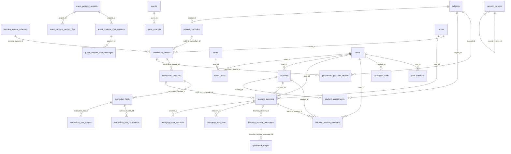
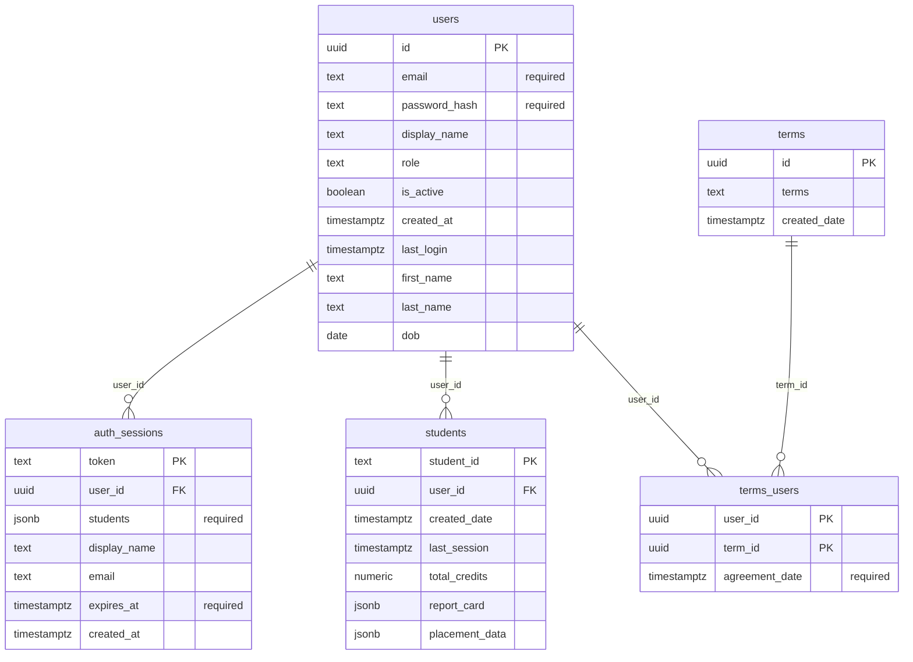
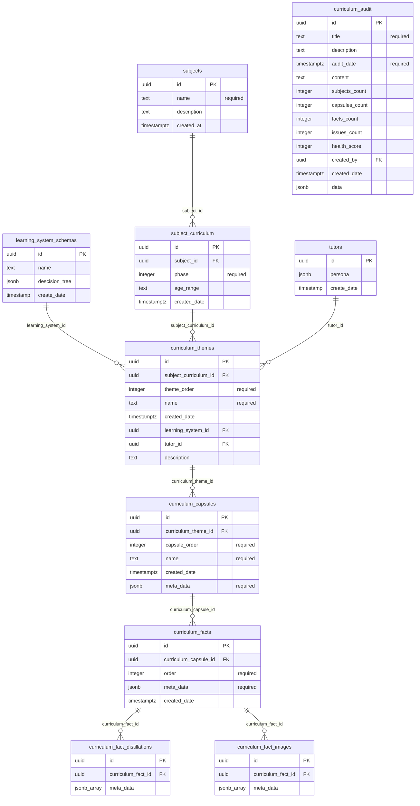
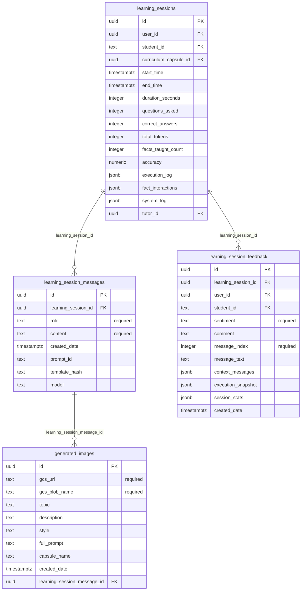
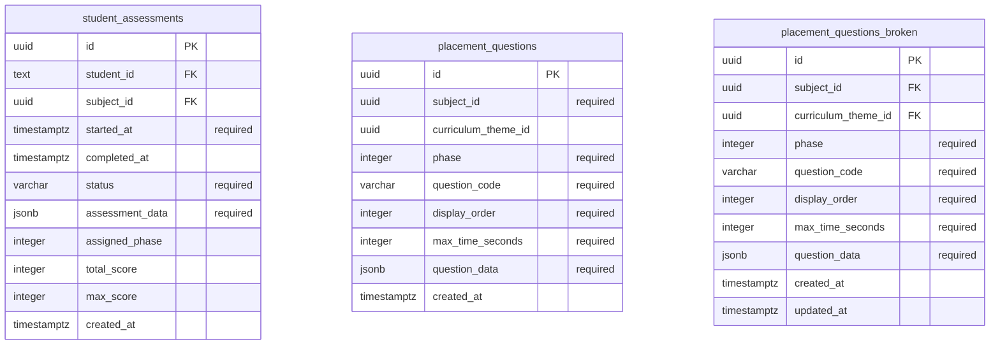
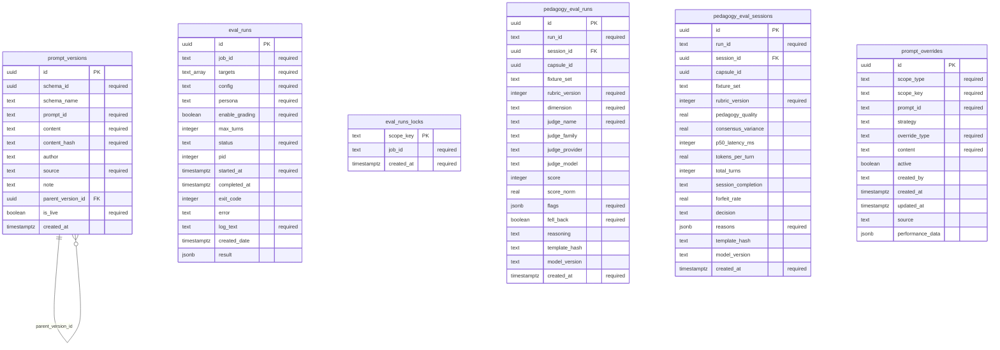
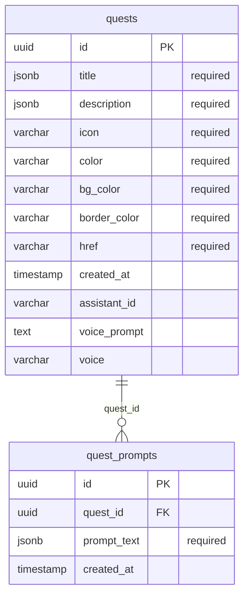
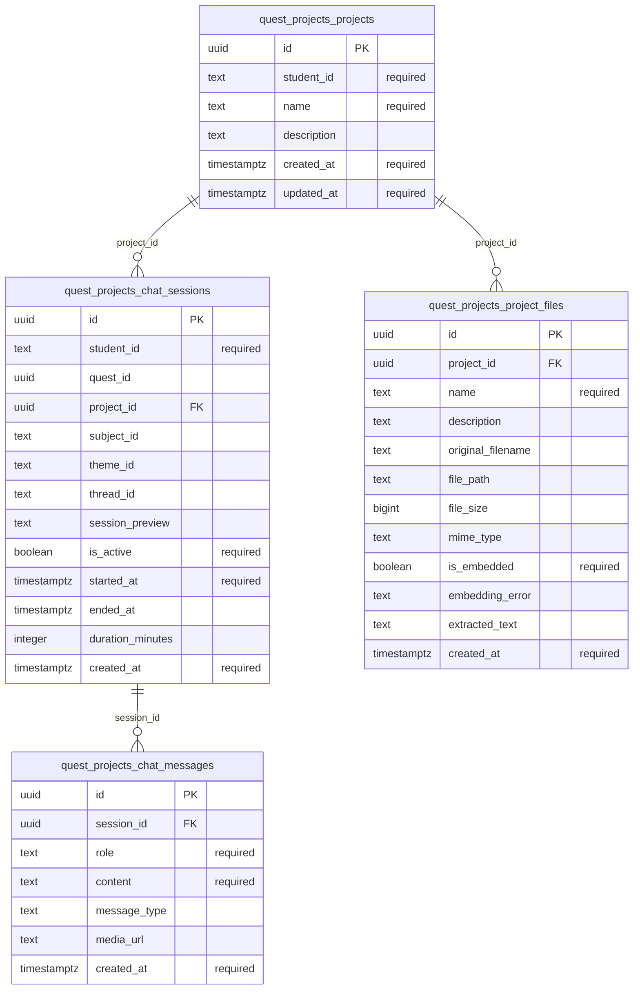
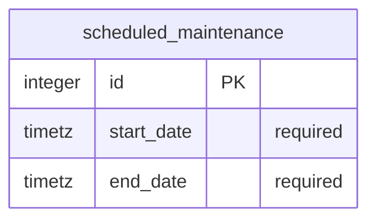

# Database schema

The base schema for ZingBee Ultra: **35 tables** (31 in `public`, 4 in `quest_projects`), 299 columns, 33 foreign keys and 1 view.

PostgreSQL 16+. All identifiers are `uuid` (`gen_random_uuid()`) unless noted; timestamps are `timestamptz` (UTC). Rich content is stored in `jsonb` columns rather than being normalised — see [JSONB columns](#jsonb-columns).

## Applying it

```bash
createdb zingbee-ultra

# 1. Base schema (tables, constraints, indexes, view, trigger)
psql -d zingbee-ultra -v ON_ERROR_STOP=1 -f db/schema.sql

# 2. Migrations — all idempotent, safe to re-run
for f in db/migrations/00*.sql db/0*.sql db/migrate-*.sql; do
  psql -d zingbee-ultra -v ON_ERROR_STOP=1 -f "$f"
done
```

`db/schema.sql` is a structure-only dump and contains **no application data**. It already includes everything the numbered migrations in `db/` create, so those are no-ops on a fresh install; `db/migrations/001`–`003` do add new objects (`prompt_overrides` and the `quest_projects` schema). Requires the `pg_trgm`, `pgcrypto` and `uuid-ossp` extensions.

> The production image also ships `timescaledb` and `timescaledb_toolkit`, but nothing uses them — the source declares zero hypertables, chunks and continuous aggregates — so their `CREATE EXTENSION` lines are commented out in `db/schema.sql` and the schema restores on vanilla PostgreSQL.

## Entity relationship diagram

Relationships only. Per-domain diagrams with columns follow.



Standalone tables (no foreign keys in either direction): `eval_runs`, `eval_runs_locks`, `placement_questions`, `prompt_overrides`, `scheduled_maintenance`.

## Domains

### Identity and access

Accounts, sessions, students and terms acceptance.



### Curriculum

The Subject -> Phase -> Theme -> Capsule -> Fact hierarchy, plus tutors and enrichment.



### Learning sessions

Tutoring sessions, their message transcripts, feedback and generated media.



### Assessment and placement

Placement assessments that assign a student a starting phase.



### Evaluation and prompts

Model/pedagogy evaluation runs and the versioned prompt registry.



### Quests

Quest definitions and their i18n prompt bodies.



### Quest projects (isolated schema)

Added by `db/migrations/003_quest_projects_schema.sql`. Deliberately isolated in its own `quest_projects` schema with NO cross-schema foreign keys into `public`, so it can be dropped without touching the tutoring tables.



### Operations

Scheduled maintenance windows.



## JSONB columns

Much of the domain model lives in `jsonb` rather than in normalised tables. The important ones:

| Column | Contents |
|---|---|
| `students.report_card` | Per-student mastery tree, nested `subject -> phase -> theme -> capsule -> {status, completed_at, mastery_level, credits, facts:{fact_id:{is_taught, is_assessed, is_mastered, exposure_count, correct_count, incorrect_count}}}`. |
| `students.placement_data` | Result of the placement assessment: the assigned starting phase per subject. |
| `curriculum_facts.meta_data` | The fact itself plus its 7 enrichment types: `core_fact`, `difficulty_weight`, `scaffold`, `vocabulary[]`, `processes[]`, `applications[]`, `micro_checks[]`, `misconceptions[]`, `evidence[]`, `stretch_questions[]`. |
| `curriculum_capsules.meta_data` | Capsule-level metadata and authoring notes. |
| `tutors.persona` | Tutor identity — `tutor_name`, `creator_name`, `persona_traits[]`, `persona_description`. There is no top-level `tutor_name` column; query it as `persona ->> 'tutor_name'`. |
| `learning_sessions.execution_log` | Ordered trace of state-machine transitions for the session. |
| `learning_sessions.fact_interactions` | Per-fact interaction outcomes within the session. |
| `learning_sessions.system_log` | Engine/system diagnostics for the session. |
| `learning_system_schemas.descision_tree` | The versioned tutoring decision tree: `states` (the graph shown in the portal) and `prompt_registry` (the templates the engine renders). Note the historical misspelling of "decision" in the column name. |
| `student_assessments.assessment_data` | Questions asked, answers given and per-item scoring. |
| `curriculum_audit.data` | Per-capsule audit findings and issue lists behind the health score. |

A full inventory of every `jsonb` / `jsonb[]` column:

| Table | Column | Type |
|---|---|---|
| `auth_sessions` | `students` | `jsonb` |
| `curriculum_audit` | `data` | `jsonb` |
| `curriculum_capsules` | `meta_data` | `jsonb` |
| `curriculum_fact_distillations` | `meta_data` | `jsonb[]` |
| `curriculum_fact_images` | `meta_data` | `jsonb[]` |
| `curriculum_facts` | `meta_data` | `jsonb` |
| `eval_runs` | `result` | `jsonb` |
| `learning_session_feedback` | `context_messages` | `jsonb` |
| `learning_session_feedback` | `execution_snapshot` | `jsonb` |
| `learning_session_feedback` | `session_stats` | `jsonb` |
| `learning_sessions` | `execution_log` | `jsonb` |
| `learning_sessions` | `fact_interactions` | `jsonb` |
| `learning_sessions` | `system_log` | `jsonb` |
| `learning_system_schemas` | `descision_tree` | `jsonb` |
| `pedagogy_eval_runs` | `flags` | `jsonb` |
| `pedagogy_eval_sessions` | `reasons` | `jsonb` |
| `placement_questions` | `question_data` | `jsonb` |
| `placement_questions_broken` | `question_data` | `jsonb` |
| `prompt_overrides` | `performance_data` | `jsonb` |
| `quest_prompts` | `prompt_text` | `jsonb` |
| `quests` | `description` | `jsonb` |
| `quests` | `title` | `jsonb` |
| `student_assessments` | `assessment_data` | `jsonb` |
| `students` | `placement_data` | `jsonb` |
| `students` | `report_card` | `jsonb` |
| `tutors` | `persona` | `jsonb` |

## Table reference

### Identity and access

#### `users`

| Column | Type | Null | Key | Default |
|---|---|---|---|---|
| `id` | uuid | no | PK | `gen_random_uuid()` |
| `email` | text | no |  |  |
| `password_hash` | text | no |  |  |
| `display_name` | text | yes |  |  |
| `role` | text | yes |  | `'tester'::text` |
| `is_active` | boolean | yes |  | `true` |
| `created_at` | timestamptz | yes |  | `now()` |
| `last_login` | timestamptz | yes |  |  |
| `first_name` | text | yes |  |  |
| `last_name` | text | yes |  |  |
| `dob` | date | yes |  |  |

Referenced by: `auth_sessions.user_id`, `curriculum_audit.created_by`, `learning_session_feedback.user_id`, `learning_sessions.user_id`, `students.user_id`, `terms_users.user_id`

Indexes: 4

#### `auth_sessions`

| Column | Type | Null | Key | Default |
|---|---|---|---|---|
| `token` | text | no | PK |  |
| `user_id` | uuid | no | FK |  |
| `students` | jsonb | no |  | `'[]'::jsonb` |
| `display_name` | text | yes |  |  |
| `email` | text | yes |  |  |
| `expires_at` | timestamptz | no |  |  |
| `created_at` | timestamptz | yes |  | `now()` |

References: `user_id` → `users.id`

Indexes: 2

#### `students`

| Column | Type | Null | Key | Default |
|---|---|---|---|---|
| `student_id` | text | no | PK | `(gen_random_uuid())::text` |
| `user_id` | uuid | no | FK |  |
| `created_date` | timestamptz | yes |  | `now()` |
| `last_session` | timestamptz | yes |  |  |
| `total_credits` | numeric | yes |  | `0` |
| `report_card` | jsonb | yes |  | `'{}'::jsonb` |
| `placement_data` | jsonb | yes |  | `'{}'::jsonb` |

References: `user_id` → `users.id`

Referenced by: `learning_session_feedback.student_id`, `learning_sessions.student_id`, `student_assessments.student_id`

Indexes: 2

#### `terms`

| Column | Type | Null | Key | Default |
|---|---|---|---|---|
| `id` | uuid | no | PK | `gen_random_uuid()` |
| `terms` | text | yes |  |  |
| `created_date` | timestamptz | yes |  | `CURRENT_TIMESTAMP` |

Referenced by: `terms_users.term_id`

Indexes: 1

#### `terms_users`

| Column | Type | Null | Key | Default |
|---|---|---|---|---|
| `user_id` | uuid | no | PK |  |
| `term_id` | uuid | no | PK |  |
| `agreement_date` | timestamptz | no |  | `CURRENT_TIMESTAMP` |

References: `term_id` → `terms.id`, `user_id` → `users.id`

Indexes: 1

### Curriculum

#### `subjects`

| Column | Type | Null | Key | Default |
|---|---|---|---|---|
| `id` | uuid | no | PK | `gen_random_uuid()` |
| `name` | text | no |  |  |
| `description` | text | yes |  |  |
| `created_at` | timestamptz | yes |  | `now()` |

Referenced by: `placement_questions_broken.subject_id`, `student_assessments.subject_id`, `subject_curriculum.subject_id`

Indexes: 2

#### `subject_curriculum`

| Column | Type | Null | Key | Default |
|---|---|---|---|---|
| `id` | uuid | no | PK | `gen_random_uuid()` |
| `subject_id` | uuid | no | FK |  |
| `phase` | integer | no |  |  |
| `age_range` | text | yes |  |  |
| `created_date` | timestamptz | yes |  | `now()` |

References: `subject_id` → `subjects.id`

Referenced by: `curriculum_themes.subject_curriculum_id`

Indexes: 2

#### `curriculum_themes`

| Column | Type | Null | Key | Default |
|---|---|---|---|---|
| `id` | uuid | no | PK | `gen_random_uuid()` |
| `subject_curriculum_id` | uuid | no | FK |  |
| `theme_order` | integer | no |  |  |
| `name` | text | no |  |  |
| `created_date` | timestamptz | yes |  | `now()` |
| `learning_system_id` | uuid | yes | FK |  |
| `tutor_id` | uuid | no | FK |  |
| `description` | text | yes |  | `''::text` |

References: `learning_system_id` → `learning_system_schemas.id`, `subject_curriculum_id` → `subject_curriculum.id`, `tutor_id` → `tutors.id`

Referenced by: `curriculum_capsules.curriculum_theme_id`, `placement_questions_broken.curriculum_theme_id`

Indexes: 3

#### `curriculum_capsules`

| Column | Type | Null | Key | Default |
|---|---|---|---|---|
| `id` | uuid | no | PK | `gen_random_uuid()` |
| `curriculum_theme_id` | uuid | no | FK |  |
| `capsule_order` | integer | no |  |  |
| `name` | text | no |  |  |
| `created_date` | timestamptz | yes |  | `now()` |
| `meta_data` | jsonb | no |  | `'{}'::jsonb` |

References: `curriculum_theme_id` → `curriculum_themes.id`

Referenced by: `curriculum_facts.curriculum_capsule_id`, `learning_sessions.curriculum_capsule_id`

Indexes: 5

#### `curriculum_facts`

| Column | Type | Null | Key | Default |
|---|---|---|---|---|
| `id` | uuid | no | PK | `gen_random_uuid()` |
| `curriculum_capsule_id` | uuid | no | FK |  |
| `order` | integer | no |  |  |
| `meta_data` | jsonb | no |  |  |
| `created_date` | timestamptz | yes |  | `now()` |

References: `curriculum_capsule_id` → `curriculum_capsules.id`

Referenced by: `curriculum_fact_distillations.curriculum_fact_id`, `curriculum_fact_images.curriculum_fact_id`

Indexes: 3

#### `curriculum_fact_distillations`

| Column | Type | Null | Key | Default |
|---|---|---|---|---|
| `id` | uuid | no | PK |  |
| `curriculum_fact_id` | uuid | no | FK |  |
| `meta_data` | jsonb[] | yes |  |  |

References: `curriculum_fact_id` → `curriculum_facts.id`

Indexes: 2

#### `curriculum_fact_images`

| Column | Type | Null | Key | Default |
|---|---|---|---|---|
| `id` | uuid | no | PK | `gen_random_uuid()` |
| `curriculum_fact_id` | uuid | no | FK |  |
| `meta_data` | jsonb[] | yes |  |  |

References: `curriculum_fact_id` → `curriculum_facts.id`

Indexes: 3

#### `curriculum_audit`

| Column | Type | Null | Key | Default |
|---|---|---|---|---|
| `id` | uuid | no | PK | `gen_random_uuid()` |
| `title` | text | no |  |  |
| `description` | text | yes |  |  |
| `audit_date` | timestamptz | no |  | `now()` |
| `content` | text | yes |  |  |
| `subjects_count` | integer | yes |  | `0` |
| `capsules_count` | integer | yes |  | `0` |
| `facts_count` | integer | yes |  | `0` |
| `issues_count` | integer | yes |  | `0` |
| `health_score` | integer | yes |  | `0` |
| `created_by` | uuid | yes | FK |  |
| `created_date` | timestamptz | yes |  | `now()` |
| `data` | jsonb | yes |  |  |

References: `created_by` → `users.id`

Indexes: 1

#### `tutors`

| Column | Type | Null | Key | Default |
|---|---|---|---|---|
| `id` | uuid | no | PK | `gen_random_uuid()` |
| `persona` | jsonb | yes |  |  |
| `create_date` | timestamp | yes |  | `CURRENT_TIMESTAMP` |

Referenced by: `curriculum_themes.tutor_id`, `learning_sessions.tutor_id`

Indexes: 1

#### `learning_system_schemas`

| Column | Type | Null | Key | Default |
|---|---|---|---|---|
| `id` | uuid | no | PK | `gen_random_uuid()` |
| `name` | text | yes |  |  |
| `descision_tree` | jsonb | yes |  |  |
| `create_date` | timestamp | yes |  | `CURRENT_TIMESTAMP` |

Referenced by: `curriculum_themes.learning_system_id`

Indexes: 1

### Learning sessions

#### `learning_sessions`

| Column | Type | Null | Key | Default |
|---|---|---|---|---|
| `id` | uuid | no | PK | `gen_random_uuid()` |
| `user_id` | uuid | no | FK |  |
| `student_id` | text | no | FK |  |
| `curriculum_capsule_id` | uuid | yes | FK |  |
| `start_time` | timestamptz | yes |  |  |
| `end_time` | timestamptz | yes |  |  |
| `duration_seconds` | integer | yes |  |  |
| `questions_asked` | integer | yes |  | `0` |
| `correct_answers` | integer | yes |  | `0` |
| `total_tokens` | integer | yes |  | `0` |
| `facts_taught_count` | integer | yes |  | `0` |
| `accuracy` | numeric | yes |  |  |
| `execution_log` | jsonb | yes |  | `'[]'::jsonb` |
| `fact_interactions` | jsonb | yes |  | `'[]'::jsonb` |
| `system_log` | jsonb | yes |  | `'[]'::jsonb` |
| `tutor_id` | uuid | no | FK |  |

References: `curriculum_capsule_id` → `curriculum_capsules.id`, `student_id` → `students.student_id`, `tutor_id` → `tutors.id`, `user_id` → `users.id`

Referenced by: `learning_session_feedback.learning_session_id`, `learning_session_messages.learning_session_id`, `pedagogy_eval_runs.session_id`, `pedagogy_eval_sessions.session_id`

Indexes: 4

#### `learning_session_messages`

| Column | Type | Null | Key | Default |
|---|---|---|---|---|
| `id` | uuid | no | PK | `gen_random_uuid()` |
| `learning_session_id` | uuid | no | FK |  |
| `role` | text | no |  |  |
| `content` | text | no |  |  |
| `created_date` | timestamptz | yes |  | `now()` |
| `prompt_id` | text | yes |  |  |
| `template_hash` | text | yes |  |  |
| `model` | text | yes |  |  |

References: `learning_session_id` → `learning_sessions.id`

Referenced by: `generated_images.learning_session_message_id`

Indexes: 3

#### `learning_session_feedback`

| Column | Type | Null | Key | Default |
|---|---|---|---|---|
| `id` | uuid | no | PK | `gen_random_uuid()` |
| `learning_session_id` | uuid | yes | FK |  |
| `user_id` | uuid | no | FK |  |
| `student_id` | text | no | FK |  |
| `sentiment` | text | no |  |  |
| `comment` | text | yes |  |  |
| `message_index` | integer | no |  |  |
| `message_text` | text | yes |  |  |
| `context_messages` | jsonb | yes |  |  |
| `execution_snapshot` | jsonb | yes |  |  |
| `session_stats` | jsonb | yes |  |  |
| `created_date` | timestamptz | yes |  | `now()` |

References: `learning_session_id` → `learning_sessions.id`, `student_id` → `students.student_id`, `user_id` → `users.id`

Indexes: 4

#### `generated_images`

| Column | Type | Null | Key | Default |
|---|---|---|---|---|
| `id` | uuid | no | PK | `gen_random_uuid()` |
| `gcs_url` | text | no |  |  |
| `gcs_blob_name` | text | no |  |  |
| `topic` | text | yes |  |  |
| `description` | text | yes |  |  |
| `style` | text | yes |  |  |
| `full_prompt` | text | yes |  |  |
| `capsule_name` | text | yes |  |  |
| `created_date` | timestamptz | yes |  | `now()` |
| `learning_session_message_id` | uuid | yes | FK |  |

References: `learning_session_message_id` → `learning_session_messages.id`

Indexes: 3

### Assessment and placement

#### `student_assessments`

| Column | Type | Null | Key | Default |
|---|---|---|---|---|
| `id` | uuid | no | PK | `gen_random_uuid()` |
| `student_id` | text | no | FK |  |
| `subject_id` | uuid | no | FK |  |
| `started_at` | timestamptz | no |  | `now()` |
| `completed_at` | timestamptz | yes |  |  |
| `status` | varchar | no |  | `'in_progress'::character varying` |
| `assessment_data` | jsonb | no |  |  |
| `assigned_phase` | integer | yes |  |  |
| `total_score` | integer | yes |  |  |
| `max_score` | integer | yes |  |  |
| `created_at` | timestamptz | yes |  | `now()` |

References: `student_id` → `students.student_id`, `subject_id` → `subjects.id`

Indexes: 6

#### `placement_questions`

| Column | Type | Null | Key | Default |
|---|---|---|---|---|
| `id` | uuid | no | PK | `gen_random_uuid()` |
| `subject_id` | uuid | no |  |  |
| `curriculum_theme_id` | uuid | yes |  |  |
| `phase` | integer | no |  |  |
| `question_code` | varchar | no |  |  |
| `display_order` | integer | no |  |  |
| `max_time_seconds` | integer | no |  | `300` |
| `question_data` | jsonb | no |  |  |
| `created_at` | timestamptz | yes |  | `now()` |

Indexes: 1

#### `placement_questions_broken`

| Column | Type | Null | Key | Default |
|---|---|---|---|---|
| `id` | uuid | no | PK | `gen_random_uuid()` |
| `subject_id` | uuid | no | FK |  |
| `curriculum_theme_id` | uuid | yes | FK |  |
| `phase` | integer | no |  |  |
| `question_code` | varchar | no |  |  |
| `display_order` | integer | no |  |  |
| `max_time_seconds` | integer | no |  | `300` |
| `question_data` | jsonb | no |  |  |
| `created_at` | timestamptz | yes |  | `now()` |
| `updated_at` | timestamptz | yes |  | `now()` |

References: `curriculum_theme_id` → `curriculum_themes.id`, `subject_id` → `subjects.id`

Indexes: 6

### Evaluation and prompts

#### `eval_runs`

| Column | Type | Null | Key | Default |
|---|---|---|---|---|
| `id` | uuid | no | PK | `gen_random_uuid()` |
| `job_id` | text | no |  |  |
| `targets` | text[] | no |  | `'{}'::text[]` |
| `config` | text | no |  | `'baseline'::text` |
| `persona` | text | no |  | `'engaged_beginner'::text` |
| `enable_grading` | boolean | no |  | `false` |
| `max_turns` | integer | yes |  |  |
| `status` | text | no |  | `'running'::text` |
| `pid` | integer | yes |  |  |
| `started_at` | timestamptz | no |  | `now()` |
| `completed_at` | timestamptz | yes |  |  |
| `exit_code` | integer | yes |  |  |
| `error` | text | yes |  |  |
| `log_text` | text | no |  | `''::text` |
| `created_date` | timestamptz | yes |  | `now()` |
| `result` | jsonb | yes |  |  |

Indexes: 4

#### `eval_runs_locks`

| Column | Type | Null | Key | Default |
|---|---|---|---|---|
| `scope_key` | text | no | PK |  |
| `job_id` | text | no |  |  |
| `created_at` | timestamptz | no |  | `now()` |

Indexes: 2

#### `pedagogy_eval_runs`

| Column | Type | Null | Key | Default |
|---|---|---|---|---|
| `id` | uuid | no | PK | `gen_random_uuid()` |
| `run_id` | text | no |  |  |
| `session_id` | uuid | yes | FK |  |
| `capsule_id` | uuid | yes |  |  |
| `fixture_set` | text | yes |  |  |
| `rubric_version` | integer | no |  |  |
| `dimension` | text | no |  |  |
| `judge_name` | text | no |  |  |
| `judge_family` | text | yes |  |  |
| `judge_provider` | text | yes |  |  |
| `judge_model` | text | yes |  |  |
| `score` | integer | yes |  |  |
| `score_norm` | real | yes |  |  |
| `flags` | jsonb | no |  | `'[]'::jsonb` |
| `fell_back` | boolean | no |  | `false` |
| `reasoning` | text | yes |  |  |
| `template_hash` | text | yes |  |  |
| `model_version` | text | yes |  |  |
| `created_at` | timestamptz | no |  | `now()` |

References: `session_id` → `learning_sessions.id`

Indexes: 6

#### `pedagogy_eval_sessions`

| Column | Type | Null | Key | Default |
|---|---|---|---|---|
| `id` | uuid | no | PK | `gen_random_uuid()` |
| `run_id` | text | no |  |  |
| `session_id` | uuid | yes | FK |  |
| `capsule_id` | uuid | yes |  |  |
| `fixture_set` | text | yes |  |  |
| `rubric_version` | integer | no |  |  |
| `pedagogy_quality` | real | yes |  |  |
| `consensus_variance` | real | yes |  |  |
| `p50_latency_ms` | integer | yes |  |  |
| `tokens_per_turn` | real | yes |  |  |
| `total_turns` | integer | yes |  |  |
| `session_completion` | text | yes |  |  |
| `forfeit_rate` | real | yes |  |  |
| `decision` | text | yes |  |  |
| `reasons` | jsonb | no |  | `'[]'::jsonb` |
| `template_hash` | text | yes |  |  |
| `model_version` | text | yes |  |  |
| `created_at` | timestamptz | no |  | `now()` |

References: `session_id` → `learning_sessions.id`

Indexes: 5

#### `prompt_versions`

| Column | Type | Null | Key | Default |
|---|---|---|---|---|
| `id` | uuid | no | PK | `gen_random_uuid()` |
| `schema_id` | uuid | no |  |  |
| `schema_name` | text | yes |  |  |
| `prompt_id` | text | no |  |  |
| `content` | text | no |  |  |
| `content_hash` | text | no |  |  |
| `author` | text | yes |  |  |
| `source` | text | no |  | `'manual'::text` |
| `note` | text | yes |  |  |
| `parent_version_id` | uuid | yes | FK |  |
| `is_live` | boolean | no |  | `false` |
| `created_at` | timestamptz | yes |  | `now()` |

References: `parent_version_id` → `prompt_versions.id`

Referenced by: `prompt_versions.parent_version_id`

Indexes: 4

#### `prompt_overrides`

| Column | Type | Null | Key | Default |
|---|---|---|---|---|
| `id` | uuid | no | PK | `gen_random_uuid()` |
| `scope_type` | text | no |  |  |
| `scope_key` | text | no |  |  |
| `prompt_id` | text | no |  |  |
| `strategy` | text | yes |  |  |
| `override_type` | text | no |  |  |
| `content` | text | no |  |  |
| `active` | boolean | yes |  | `true` |
| `created_by` | text | yes |  |  |
| `created_at` | timestamptz | yes |  | `now()` |
| `updated_at` | timestamptz | yes |  | `now()` |
| `source` | text | yes |  | `'manual'::text` |
| `performance_data` | jsonb | yes |  |  |

Indexes: 5

### Quests

#### `quests`

| Column | Type | Null | Key | Default |
|---|---|---|---|---|
| `id` | uuid | no | PK | `uuid_generate_v4()` |
| `title` | jsonb | no |  |  |
| `description` | jsonb | no |  |  |
| `icon` | varchar | no |  |  |
| `color` | varchar | no |  |  |
| `bg_color` | varchar | no |  |  |
| `border_color` | varchar | no |  |  |
| `href` | varchar | no |  |  |
| `created_at` | timestamp | yes |  | `CURRENT_TIMESTAMP` |
| `assistant_id` | varchar | yes |  |  |
| `voice_prompt` | text | yes |  |  |
| `voice` | varchar | yes |  | `'eve'::character varying` |

Referenced by: `quest_prompts.quest_id`

Indexes: 1

#### `quest_prompts`

| Column | Type | Null | Key | Default |
|---|---|---|---|---|
| `id` | uuid | no | PK | `uuid_generate_v4()` |
| `quest_id` | uuid | no | FK |  |
| `prompt_text` | jsonb | no |  |  |
| `created_at` | timestamp | yes |  | `CURRENT_TIMESTAMP` |

References: `quest_id` → `quests.id`

Indexes: 2

### Quest projects (isolated schema)

#### `quest_projects.projects`

| Column | Type | Null | Key | Default |
|---|---|---|---|---|
| `id` | uuid | no | PK | `gen_random_uuid()` |
| `student_id` | text | no |  |  |
| `name` | text | no |  |  |
| `description` | text | yes |  |  |
| `created_at` | timestamptz | no |  | `now()` |
| `updated_at` | timestamptz | no |  | `now()` |

Referenced by: `quest_projects.chat_sessions.project_id`, `quest_projects.project_files.project_id`

Indexes: 2

#### `quest_projects.chat_sessions`

| Column | Type | Null | Key | Default |
|---|---|---|---|---|
| `id` | uuid | no | PK | `gen_random_uuid()` |
| `student_id` | text | no |  |  |
| `quest_id` | uuid | yes |  |  |
| `project_id` | uuid | yes | FK |  |
| `subject_id` | text | yes |  |  |
| `theme_id` | text | yes |  |  |
| `thread_id` | text | yes |  |  |
| `session_preview` | text | yes |  |  |
| `is_active` | boolean | no |  | `true` |
| `started_at` | timestamptz | no |  | `now()` |
| `ended_at` | timestamptz | yes |  |  |
| `duration_minutes` | integer | yes |  |  |
| `created_at` | timestamptz | no |  | `now()` |

References: `project_id` → `quest_projects.projects.id`

Referenced by: `quest_projects.chat_messages.session_id`

Indexes: 4

#### `quest_projects.chat_messages`

| Column | Type | Null | Key | Default |
|---|---|---|---|---|
| `id` | uuid | no | PK | `gen_random_uuid()` |
| `session_id` | uuid | no | FK |  |
| `role` | text | no |  |  |
| `content` | text | no |  | `''::text` |
| `message_type` | text | yes |  |  |
| `media_url` | text | yes |  |  |
| `created_at` | timestamptz | no |  | `now()` |

References: `session_id` → `quest_projects.chat_sessions.id`

Indexes: 2

#### `quest_projects.project_files`

| Column | Type | Null | Key | Default |
|---|---|---|---|---|
| `id` | uuid | no | PK | `gen_random_uuid()` |
| `project_id` | uuid | no | FK |  |
| `name` | text | no |  |  |
| `description` | text | yes |  |  |
| `original_filename` | text | yes |  |  |
| `file_path` | text | yes |  |  |
| `file_size` | bigint | yes |  |  |
| `mime_type` | text | yes |  |  |
| `is_embedded` | boolean | no |  | `false` |
| `embedding_error` | text | yes |  |  |
| `extracted_text` | text | yes |  |  |
| `created_at` | timestamptz | no |  | `now()` |

References: `project_id` → `quest_projects.projects.id`

Indexes: 2

### Operations

#### `scheduled_maintenance`

| Column | Type | Null | Key | Default |
|---|---|---|---|---|
| `id` | integer | no | PK |  |
| `start_date` | timetz | no |  |  |
| `end_date` | timetz | no |  |  |

Indexes: 1

